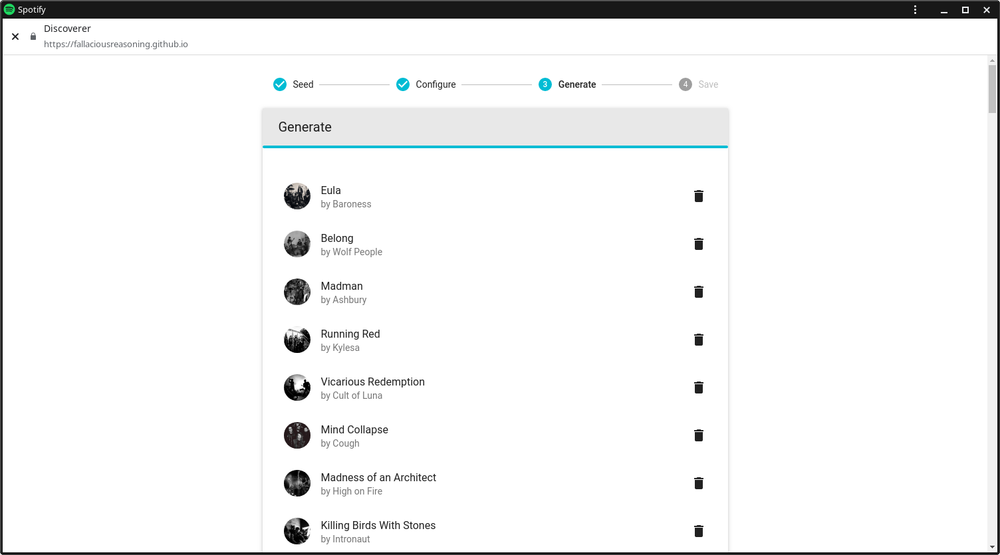

# `launch` Event Explainer

Author: Matt Giuca &lt;<mgiuca@chromium.org>&gt;
Author: Eric Willigers &lt;<ericwilligers@chromium.org>&gt;
Author: Jay Harris &lt;<harrisjay@chromium.org>&gt;
Author: Raymes Khoury &lt;<raymes@chromium.org>&gt;

Created: 2017-09-22
Updated: 2019-03-15

## Introduction

This explainer proposes a new API for Service Workers that allows web applications to control which window/tab they will open in.

Example Service Worker code to handle all launches of a web app in an existing window if one exists:

```js
self.addEventListener('launch', event => {
  event.waitUntil(async () => {
    const allClients = await clients.matchAll();
    // If there isn't one available, open a new window.
    if (allClients.length === 0) {
      clients.openWindow(event.request.url);
      event.preventDefault();
      return;
    }

    const client = allClients[0];
    client.focus();
    event.preventDefault();
  }());
});
```

## Background

There are many different ways that web apps can be launched at present. These include:
1. **Navigations:** A user clicks a link into a Social Media web app.
2. **OS Shortcuts:** A user opens an Image Editor web app using an OS shortcut (e.g. on their 
   desktop). This shortcut was created when they installed the app.
3. **Protocol Handlers:** A user clicks on a `mailto:` protocol link which a website has registered to handle using the [`registerProtocolHandler`](https://html.spec.whatwg.org/multipage/system-state.html#dom-navigator-registerprotocolhandler) API.
4. **Web Share Target:** A user shares an image with an Image Editor web app that has registered as
   a share target using the [Web Share Target API](https://wicg.github.io/web-share-target/level-2/).

There are also ways to launch web apps which don't exist yet, but which we would like to have in the future:
1. **File Handlers:** A user opens a file that an Image Editor web app has registered to handle.
2. **URL Request Handlers:** A user navigates to a PDF and it is opened using a PDF viewer web app.
3. **Deep-link shortcuts API**. A user clicks an OS action to compose a new email with an email client. They are taken to the compose screen of the email client. (Proposed API: [proposal 1](https://gist.github.com/kenchris/0acec2790cd38dfdff0a7197ff00d1de); [proposal 2](https://docs.google.com/a/chromium.org/document/d/1WzpCnpc1N7WjDJnFmj90-Z5SALI3cSPtNrYuH1EVufg/edit)). 

## Motivating Examples

Currently web apps have no control over how they will be launched. e.g. they have no control over whether launches will happen in a new window/tab or an existing window/tab that the web app controls. This explainer proposes a new API for Service Workers that allows web applications to control which window/tab they will open in.

Examples:
* A music player might be playing a track; if the user clicks a link to another track in the player's scope, instead of opening a new tab to the track (possibly playing music over the existing music), it could focus the existing tab, show the new track info but keep playing the old track in the background.
* Banking websites as well as messaging apps can often fail if users try to use them from multiple tabs. This API could be used to bounce the user back into an existing tab if they already have one open.
* A document editor could allow a separate window for each document, but if the user clicks a link to a document that is already open in a tab, focus that window instead of opening a duplicate.

In some cases, web apps may not want to open a new window at all, and may be content to show a notification. e.g.
* A "`magnet:`" URL is handled by a torrent client, which automatically starts downloading the file, showing a notification but not opening a new window or tab.
* A "save for later" tool that has a share target. When the share target is chosen, it just shows a notification "Saved for later", but doesn't actually spawn a browsing context.

## `launch` Event

This explainer proposes a new API for Service Workers to prevent certain incoming navigations into a web app from completing. The navigation can then be handled with custom logic. This allows sites to catch new windows or tabs being opened in their scope, block the window/tab from opening, and redirect the navigation into an existing window. 

Crucially, this only allows *certain* navigations to be intercepted. The user is still in control of the experience, so if they really want to, they can say "Open in new tab" and the app will not be allowed to prevent the page from opening. This is only used to prevent basic navigations, such as left-clicking a link.

Further, not every navigation to a web app would trigger a `launch` event, only those that indicate it is being launched like an app. Typically, only events external to the app could trigger a `launch` event (e.g. navigations from a website outside of the app's scope into the app, opening a file, sharing a link to the app).

Notice that all the current ways of launching an app described in the [Background](#background) section invoke the app via a navigation:
1. **OS Shortcuts:** The launch URL in the web app manifest will be navigated to.
3. **Protocol Handlers:** A URL is registered to be the protocol handler. This will be navigated to and data about the invocation will be passed in URL parameters.
4. **Web Share Target:** A URL is associated with a share target. This will be navigated to. Share data is passed via GET or POST parameters.

Hence, this proposal would allow web apps to control their launch surface for all of the above types of invocation.

### Example

Example Service Worker code to redirect navigations into an existing window:

```js
self.addEventListener('launch', event => {
  event.waitUntil(async () => {
    const allClients = await clients.matchAll();
    // If there isn't one available, open a new window.
    if (allClients.length === 0) {
      clients.openWindow(event.request.url)
      event.preventDefault();
      return;
    }

    const client = allClients[0];
    client.postMessage(event.request.url);
    client.focus();
    event.preventDefault();
  }());
});
```
Notes:
* `waitUntil` delays the user agent from launching and waits for the promise. This is necessary because inspecting existing client windows happens asynchronously.
* `preventDefault` is analogous to [`FetchEvent`](https://www.w3.org/TR/service-workers-1/#fetch-event-section)'s `respondWith` method. If it is called (during the `launch` event handler), it stops the user agent from completing the navigation that triggered the `launch`. Nothing further happens (the user agent assumes the app has handled it).
* The `launch` event is considered to be "allowed to show a popup", so that `Clients.openWindow` and `Client.focus` can be used.
* If the event handler doesn't call `event.preventDefault()`, continue the original navigation as if the `launch` event wasn't fired.

### Event Definition

```ts
interface LaunchEvent : ExtendableEvent {
  readonly attribute Request request;
}
```
Notes:
* The `Request` that led to the navigation is included. In addition to the URL, this allows sites to inspect things like POST data (e.g. for a Web Share Target) that led to the invocation of the app. 
## Design Questions/Concerns

### Addressing malicious or poorly written Sites

not-a-great-experience.com could register a `launch` handler that just calls `preventDefault` without doing anything. This would result in a poor user experience as the user could click links into the site, or share files with the site and nothing would happen.

Similarly, slow-experience.com may unintentionally do a lot of processing in the `launch` event handler before it opens any UI surface. The user could open a file that would be handled by the app and not see anything for a long time. This would also be a poor user experience.

#### Solution 1 (preferred): User agents provide UX to mitigate slow `launch` handlers

User agents can give feedback to users when a site is handling a `launch` event to signify that the app is loading. User agents have a lot of flexibility to experiment here but some suggestions on what could be done if the app doesn't show some UI after a small delay (e.g. 1-2 seconds):
- Show a splash screen indicating the app is launching
- Show an entry for the app in the taskbar/dock/shelf indicating it's loading
- Focus a previously opened window in the scope of the app
- TODO: mitigations for non-installed sites

If the app doesn't show UI after a long delay (e.g. 10 seconds), the user agent could:
- Kill the `launch` event handler and show an error message indicating the app couldn't launch
- If apps behave badly on a repetitive basis, don't allow it to handle `launch` events (fallback to opening URLs directly in their default context)

#### Solution 2: `launch` event on Window rather than Service Worker

Another solution to this problem that has been proposed is to handle `launch` events in windows rather than in the Service Worker. If an existing window in the scope of the web app is opened and had registered a `launch` handler, the event would be sent there and the window focused immediately. If no existing window is opened, a new window would automatically be opened, navigated to the target URL and the event would then be sent (after the `onload` event had fired).

This proposal restricts what would be possible with `launch` events, and could also result in a poor user experience:
- It would not be possible to allow websites to only show a notification from the `launch` event and not display any window
- If an existing window is open and the app wants to open a new window, a flicker of the existing window will be shown as it is focused prior triggering the event
- In terms of ergonomics, developers must be careful to register `launch` event handlers on all windows and to co-ordinate between them. Often this will involve going through the service worker anyway.

### Whether `launch` events should *only* be triggered by navigations

In the proposal described so far, all `launch` events are triggered by navigations to URLs. However, it's an open question whether this would be a pre-requisite for future `launch` events. The [File Handlers API](https://github.com/WICG/file-handling/blob/master/explainer.md) is introducing the ability for web apps to register themselves as handlers for certain file types. When designing this API there is a choice:
1. Pass file handles to the app via the `launch` event in the service worker
2. Invent a new way of passing file handles to windows. For example, the browser could launch a URL and pass blob URLs as query parameters, e.g. https://example.com/file_handler?file1=blob://abcdefg&file2=blob://tuvwxyz.

Option 1 seems more intuitive even though there is no precedent for this. However it requires `launch` events being more generally designed: 

```ts
enum LaunchType {
  "navigation",
  "file"
};

interface LaunchEvent : ExtendableEvent {
  readonly attribute LaunchType type;
}

interface NavigationLaunchEvent : LaunchEvent {
  readonly attribute Request request;
}

interface FileLaunchEvent : LaunchEvent {
  readonly attribute FileSystemFileHandle[] files;
}
```

Alternatively, rather than specifying a `type` attribute and class hierarchy, different types of event could be fired in different cases, such as `launch-navigation` and `launch-file`, or invocation specific arguments could be optional.

On the other hand, the debate of whether to fire a SW event or to trigger a URL navigation with parameters has come up recently in the Deep Linking API [proposal](https://docs.google.com/document/d/1WzpCnpc1N7WjDJnFmj90-Z5SALI3cSPtNrYuH1EVufg/edit#). In that document, mgiuca@ suggests:

> Shortcuts/actions should open URLs, not fire a special SW event. This fits the Web’s defining characteristic, that “places” inside an app should be addressable via a URL.

### Responding with a Client vs. calling Client.focus()

`fetch` events provide a response via a `FetchEvent.respondWith` function. In a similar way, `launch` events could be designed to call a `LaunchEvent.launchWith` function with a `Client` which should be focused.

The main benefit to this approach is that it would ensure that developers don't forget to focus a client window. The main issue with this is that it removes the flexibility for doing things besides focusing windows. For example, `launch` events may just want to show a notification.

As an aside, the `notificationclick` event has similar challenges to the `launch` event in that handlers can be written such that nothing happens when a notification is clicked. Whatever solution is decided for `launch` event should also apply to `notificationclick` for consistency.

### Should apps that aren't installed have launch events fired?

It is unclear whether launch events should be gated on installation. Ultimately this should be up to the user agent, but it would be nice to be able to provide some kind of recommendation. 

Our preference here is that apps which are not installed don't receive launch events, so as to break user expectations of the web as little as possible (installed apps are a new thing). In general, we prefer not to gate APIs on installation, however, there is some precedence for granting more permissions upon installation; PiP and WebShareTarget, for example.

### Potentially Breaking `window.open`
`window.open` is a synchronous  API, while the nature of launch events requires them to be asynchronous. It is unclear how we will be able to reconcile these two APIs (blocking until the launch event completes doesn't seem super acceptable). This could break popup based authentication flows (and potentially more).

Due to this concern, the initial implementation of launch events will likely ship without `window.open` support, with the intent to revisit it later.

### Login Flows
Many websites make use of a login service hosted on a different origin. This origin could be on the same domain (as in the case of google.com and accounts.google.com) or through an independent OAuth service (like how spotify.com authenticates with facebook.com). These flows are not trivially compatible with launch events, and it will require some care to ensure that we do not break sites.

Three primary cases have been identified for login flows:
- Redirecting to a different first party origin
- Redirecting to a third party origin
- Opening a third party in a new tab/window.
 
and are discussed in more detail below.

> Disclaimer: These examples are all purely hypothetical, and are used to illustrate potential problems. They have no relationship with the actual behavior of the sites (and cannot, as launch events have not been implemented).

**First Party Authentication via Redirect**

A user navigates to mail.google.com. They are not logged in, so they are redirected to accounts.google.com, to authenticate themselves. If accounts.google.com has a launch event handler (perhaps for an account management PWA), then the site would need to be careful not to open an app window, as this would cause mail.google.com to be opened inside the accounts app window, potentially causing confusion.

This could be *somewhat* alleviated if mail.google.com provided its own launch handler which opened it in an app window, but this is not an ideal solution, as it would require the service worker to be already initialized. It also doesn't seem reasonable to expect every site to register a launch handler to get what is considered 'sane' behavior.

**Third Party Authentication via a Popup**

A user navigates to spotify.com. They are not logged in, so they click the 'Login in with Facebook' button, at which point a popup is triggered, prompting them to log into facebook.com.

Arguably, this case wouldn't require any special handling. The popup could be handled by a launch event or not and the behavior would be functionally identical. A new app|popup window would be opened, and, upon login, could be closed, posting a message back to the original window. However, some investigation is probably required into the behavior of `window.open` across windows and apps, and to think how it should interact with the asynchronous launch event API.

**Third Party Authentication via Redirect**

This case is very similar to that of first party auth via a redirect, except it is much more likely that the third_party is also a PWA (possibly with its own launch handler). 

In this image  a user has logged into 'Discoverer' using Spotify. Spotify's hypothetical launch event was triggered, opening a new instance of the Spotify app where the user logged in. Spotify redirected back to Discoverer but now Discoverer is open inside Spotify, which feels wrong.

**Conclusions**
These problems seems trivially solvable on the part of the third party authentication provider: Simply do not launch an application window for authentication requests from other parties (which should be detectable from the launch/redirect url). However, this solution requires us to trust application developers to 'Do the right thing', though I would argue that this risk isn't as significant is it at first seems. These authentication providers want to give app developers a good experience as, otherwise, they will use a different provider. 

## Details

Speccing this API will require amendments to the [HTML](https://html.spec.whatwg.org/) spec (**navigate** algorithm) and [Service Workers](https://www.w3.org/TR/service-workers-1) spec (where the `LaunchEvent` would live). Initially, it could exist in its own spec document, which monkey-patches the HTML spec.

This section is a rough draft of "spec-ish" language, without being too picky about getting things "right". See also the [polyfill source code](demos/polyfill.js), which roughly implements this logic.

### Firing the `launch` event

When the user agent [navigates](https://html.spec.whatwg.org/#navigate) a browsing context *browsingContext* to a URL *resource*, if *resource* is in the scope of an active service worker, the user agent **MAY** go through the `launch` flow instead of the normal navigation behaviour.

(NOTE: I don't understand the details of how new browsing contexts are created when using `window.open` or "Open in new window". I'm just going to assume that the *browsingContext* is null for navigations that open a new window or tab, and figure out the "correct" details later.)

The purpose of this "**MAY**" is to allow the user agent to determine in what situations to allow the target site to interfere with the navigation. It **SHOULD** generally be done when navigating from a resource outside the target service worker scope, but **SHOULD NOT** be done when navigating within the same service worker scope. It **SHOULD NOT** be done when the user has explicitly indicated the intended browsing context for the navigation (e.g., "Open in new tab" or "Open in new window").

If the user agent opts to use the `launch` flow, it should do the following instead of the normal navigation algorithm, within the context of *resource*'s active service worker:

1. Create a new `LaunchEvent` *event* with `type` set to `"launch"`, `url` set to *resource*.
2. Fire *event* at the service worker global scope. The event listener is **triggered by user activation**.
3. If *event* is **cancelled**, abort these steps (and do not continue with the navigation).
4. If *event*'s [[*handlePending*]] slot is null, abort these steps and proceed with the normal navigation algorithm.
5. Wait until [[*handlePending*]] is fulfilled or rejected.
6. If [[*handlePending*]] is rejected, proceed with the normal navigation algorithm. (If it is fulfilled, do not continue with the navigation.)

The user agent **MAY** go through the `launch` flow after going through the normal navigation behaviour. For example, the user agent might be displaying a choice asking asking if the user would like to use the `launch` flow for this launch and future launches. The user agent might prefer to immediately display the page being navigated to, instead of waiting for the user to make a choice.
Thus the choice might be presented as a popup that the user can ignore. If the user requests the `launch` flow, then the event fires and the navigation occurs in the window that is in focus when the event completes. Note that the navigation might involve a POST request, in which case the POST may be handled twice.

## Security and privacy considerations

* The user agent must only fire a `launch` event for navigations to URLs inside the service worker's scope, or a service worker could spy on other navigations.

## Appendix

* [Service Worker GitHub issue](https://github.com/w3c/ServiceWorker/issues/1028)
* [mgiuca proposal document](https://docs.google.com/document/d/1jWLpNEFttyLTnxsHs15oT-Hn8I81N0cwUa3JjISoPV8/edit)
